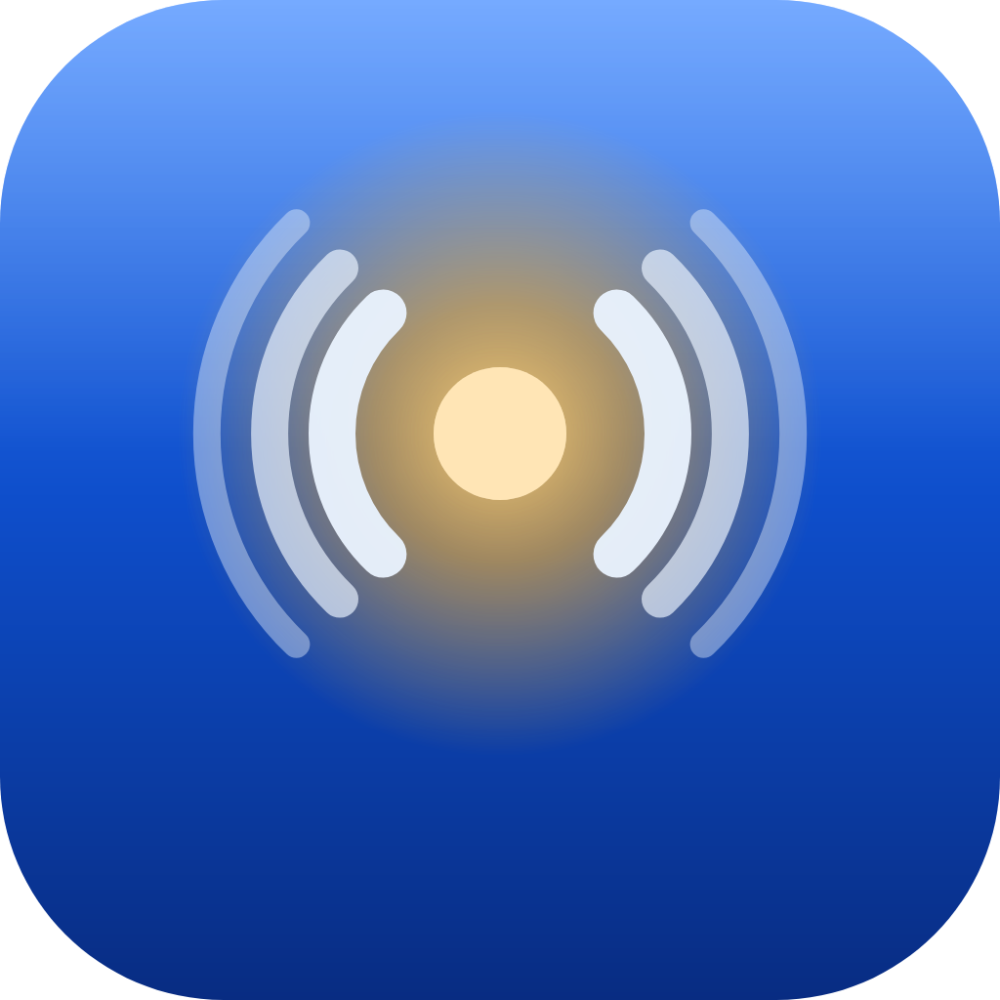

# Lumen ASR

<p align="center">
  
</p>

<p align="center">
  <strong>Speak. Polish. Paste.</strong><br />
  Local-first voice dictation for macOS — hold a hotkey, talk, get clean text in the app you’re already using.
</p>

<p align="center">
  <a href="#english">English</a> · <a href="#中文">中文</a>
</p>

---

<a id="english"></a>

## English

### Why Lumen

Most “voice typing” stops at raw speech-to-text. Lumen is built for **writing into real work**:

1. **Hold** your dictation hotkey and speak  
2. **Release** — local speech recognition turns audio into text  
3. Optional **AI cleanup** fixes punctuation, fillers, and structure  
4. Text is **pasted into the focused field** (editor, chat, browser, IDE…)  
5. Sessions stay in **History**; you can replay audio, edit, and grow a personal dictionary  

**Local by default.** Recognition runs on your Mac (SenseVoice). Cleanup can stay on-device (e.g. Ollama). When local rewrite/translate quality isn’t enough, switch the corrector to a cloud OpenAI-compatible API — same UI, better models.

| You want… | Use |
|-----------|-----|
| Privacy + offline ASR | Local SenseVoice (default) |
| Light cleanup, no cloud | Local LLM (Ollama / LM Studio) |
| Stronger rewrite / translation | Cloud corrector (e.g. MiniMax-M3, other OpenAI-compatible APIs) |
| Just the raw transcript | Cleanup level **None** / raw intent |

### Features

- **Push-to-talk** (default) or toggle recording  
- **Intent hotkeys** — e.g. default cleanup vs **translate** to another language  
- **Floating capsule** while you speak (doesn’t steal focus from the typing target)  
- **Cleanup strength** — none / light / medium / strong  
- **Personal dictionary** — terms & replacements; learn from post-paste edits  
- **Session history** with audio playback when saved  
- **First-run onboarding** for Microphone + Accessibility  

### Requirements

- macOS 12+ (Apple Silicon recommended)  
- **Microphone** — to record  
- **Accessibility** — to paste into other apps (without it, Lumen copies to the clipboard)  
- Optional: [Ollama](https://ollama.com) or any OpenAI-compatible API key for AI cleanup  

### Shared context build dependency

Lumen ASR uses the shared `lumen-context` crate maintained in the
[Lumen Navi repository](https://github.com/fakechris/lumen-navi). This is a source/build dependency,
not an application runtime dependency:

- `Cargo.toml` and `Cargo.lock` pin one exact Navi Git commit.
- A normal ASR build does not require a Navi checkout, process, daemon, database, or installation.
- The first build needs network access to fetch the pinned Git commit; later builds can use Cargo's
  local cache.
- ASR owns its own context configuration, encrypted storage, browser bridge credentials, and
  Safari App Group.

Fetch and verify all pinned Rust dependencies before building:

```bash
cargo fetch --locked
cargo build -p lumen-asr-desktop --locked
```

For an offline build, populate the cache once with `cargo fetch --locked`, then run:

```bash
CARGO_NET_OFFLINE=true cargo build -p lumen-asr-desktop --locked --release
./dev-install.sh --skip-build --open
```

Develop and test unpublished shared-library changes inside the Navi workspace:

```bash
cargo test --manifest-path ../lumen-navi/Cargo.toml -p lumen-context --locked
```

Publish shared changes in Navi before testing the ASR integration, then update ASR to the new full
commit and regenerate `Cargo.lock`. This keeps normal ASR builds reproducible and avoids a local
path override silently rewriting the lockfile. Never pin ASR to a movable branch.

### Optional context-assisted correction

Local context capture and model forwarding are separate controls. Encrypted local capture is on by
default and continues whether or not context is sent to the corrector. The forwarding switch is
**off by default** and can be changed under **Settings → AI Corrector → Use current-window
context** (`[context].send_to_corrector` in `config.toml`). Existing installations that previously
saved `[context].enabled = false` keep that explicit setting until it is changed.

When enabled, the corrector receives a text-only projection capped at 2,000 Unicode characters:
selection, cursor prefix/suffix, nearby field text, app/window/page labels, domain, and deduplicated
visible text. Full URLs, query strings, screenshots, accessibility/DOM trees, coordinates, OCR
boxes, hashes, diagnostics, and source provenance stay local. Secure editor fields and captures
whose privacy policy disallows raw text are never projected. If context is empty or unavailable,
dictation falls back to the existing ASR + dictionary correction request.

### Install & run (from source)

Prebuilt ad-hoc signed DMGs for Apple Silicon and Intel are published on
[GitHub Releases](https://github.com/fakechris/lumen-asr/releases). macOS requires a one-time manual
approval under **System Settings → Privacy & Security**. See
[docs/MACOS_GITHUB_RELEASE.md](./docs/MACOS_GITHUB_RELEASE.md) for verification and installation.

To build locally instead:

```bash
git clone <your-repo-url> lumen-asr
cd lumen-asr

# Build release app, install into .app, codesign, open
./dev-install.sh --open
```

Dev loop (hot reload UI):

```bash
cd apps/desktop
npm install
npm run tauri dev
```

> **Signing tip:** after every release build, reinstall with `./dev-install.sh` so the `.app` signature stays valid. Prefer a trusted local Code Signing certificate or free Apple Development identity so Mic / Accessibility grants survive rebuilds. Details: [docs/MACOS_LOCAL_SIGNING.md](./docs/MACOS_LOCAL_SIGNING.md).

### First-time setup (step by step)

#### 1. Launch Lumen ASR

Open `Lumen ASR.app` (from `./dev-install.sh --open` or your install path).  
If the system says the app is blocked, use **right-click → Open** once (local builds are not App Store notarized).

#### 2. Complete onboarding

The wizard walks you through:

| Step | What to do | Why |
|------|------------|-----|
| Welcome | Continue | Product overview |
| Microphone | Click request / allow in System Settings | Recording |
| Accessibility | Open Settings → enable **Lumen ASR** | Paste into other apps |
| Try voice | Hold the hotkey and say a short sentence | End-to-end check |
| Models | Confirm local ASR model is ready | Offline recognition |
| AI cleanup (optional) | Leave local Ollama or set a cloud provider later | Polish / translate |
| Finish | Start using Lumen | — |

You can re-open onboarding later from Settings if permissions were skipped.

#### 3. Grant permissions in System Settings

**System Settings → Privacy & Security**

- **Microphone** → enable **Lumen ASR**  
- **Accessibility** → enable **Lumen ASR**  

Quit Lumen fully and reopen after toggling Accessibility.

#### 4. Put a local speech model in place

Default engine: **SenseVoice** (via sherpa-onnx).

For the provider capability matrix and the distinction between hotwords, previous-transcript
context, and free-text ASR prompts, see [ASR context capability selection](docs/research/ASR_CONTEXT_CAPABILITY_SELECTION.md).

Put model files here (first match wins):

1. `LUMEN_SENSEVOICE_DIR` (env override)  
2. `~/Library/Application Support/LumenAsr/models/sensevoice/`  

Expected files:

- `model.int8.onnx` (or `model.onnx`)  
- `tokens.txt`  

In the app: **Settings → Speech recognition** should show the engine as ready.

#### 5. Choose AI cleanup (recommended path)

**Principle:** local first; go online when quality matters more than privacy.

| Mode | Settings | When |
|------|----------|------|
| **Local** | Corrector → Ollama, model you pulled (e.g. `qwen3.5:9b`) | Everyday notes, private text |
| **Cloud** | Corrector → MiniMax / OpenAI-compatible, API key + model (prefer **MiniMax-M3** for cleanup; thinking is turned off automatically) | Better rewrite & translation latency/quality |
| **Off** | Cleanup **None**, or corrector disabled | Raw ASR only |

Config file (advanced):  
`~/Library/Application Support/LumenAsr/config.toml`

#### 6. Learn the hotkeys

| Action | Default (customize in Settings) |
|--------|----------------------------------|
| Dictation (hold) | Your primary chord (e.g. **⌥⇧** / Alt+Shift) |
| Translate intent | Secondary chord if you enabled it (e.g. **⌃⌥**) |

**Flow**

1. Click into any text field (Notes, Slack, browser, IDE…).  
2. **Hold** the dictation hotkey — capsule appears.  
3. Speak.  
4. **Release** — Lumen recognizes, cleans up, pastes.  
5. Open **History** to replay audio or copy text again.  

#### 7. Tune output quality

- **Cleanup level** — Medium is a good default (clear, light cleanup).  
- **Dictionary** — add product names / jargon so ASR + cleanup keep them.  
- **History → edit** — improve a line and save learn candidates when offered.  

### Day-to-day tips

- Prefer **hold** mode until the gesture feels natural.  
- If paste fails, check Accessibility and whether the target app accepts clipboard paste.  
- If audio playback sounds wrong after many rapid tests, rebuild with `./dev-install.sh` (capture fixes ship in recent builds).  
- Cloud correctors: use models that support **disabling thinking** for dictation speed; Lumen sends no-thinking flags where the API allows it.  

### Project layout (for contributors)

```
apps/desktop/     Tauri + React app
crates/           Rust workspace (ASR, corrector, store, inject, …)
scripts/macos/    Local build, codesign, install
docs/             Design & platform notes
```

More detail: [PRODUCT.md](./PRODUCT.md) · [ARCHITECTURE.md](./ARCHITECTURE.md)

### License

Private / TBD.

---

<a id="中文"></a>

## 中文

<p align="right"><a href="#english">English</a> · <a href="#中文">中文</a></p>

### Lumen 是什么

**按住快捷键说话 → 松手 → 干净文本出现在当前输入框。**

Lumen 面向真实写作场景：本地语音识别 + 可选 AI 整理/翻译 + 自动粘贴到当前 App，并保留历史与个人词库。

**默认本地。** 识别用本机 SenseVoice；整理可用本机大模型（如 Ollama）。本地改写/翻译效果不够时，再在设置里换成在线 OpenAI 兼容接口——同一套界面，更强模型。

| 需求 | 建议 |
|------|------|
| 隐私、离线识别 | 本地 SenseVoice（默认） |
| 轻度整理、不上云 | 本地 LLM（Ollama / LM Studio） |
| 更强改写 / 翻译 | 在线修正（如 MiniMax-M3 等兼容接口） |
| 只要原始转写 | 整理强度选「无」 |

### 功能一览

- 默认 **按住说话**，也可切换为开关模式  
- **意图快捷键**（如默认整理 vs **翻译**）  
- 说话时 **悬浮胶囊**（不抢当前输入焦点）  
- 整理强度：无 / 轻 / 中 / 强  
- **个人词库**；粘贴后可从编辑中学习  
- **历史记录**与录音回放  
- 首次启动 **引导**：麦克风 + 辅助功能  

### 环境要求

- macOS 12+（建议 Apple Silicon）  
- **麦克风**：录音  
- **辅助功能**：向其他 App 粘贴（未授权时仅复制到剪贴板）  
- 可选：Ollama 或任意 OpenAI 兼容 API，用于 AI 整理  

### 共享上下文库与构建依赖

Lumen ASR 使用由 [Lumen Navi 仓库](https://github.com/fakechris/lumen-navi)维护的共享
`lumen-context` crate。这只是源码/编译期依赖，不是两个应用之间的运行时依赖：

- `Cargo.toml` 与 `Cargo.lock` 固定到 Navi 的一个完整 Git commit；
- 正常构建 ASR 不需要本机存在 Navi checkout，也不需要运行 Navi app、daemon 或数据库；
- 第一次构建需要联网获取固定的 Git commit，之后可以使用 Cargo 本地缓存离线构建；
- ASR 使用独立的上下文配置、加密存储、浏览器凭据和 Safari App Group。

首次构建前建议先获取并校验锁定依赖：

```bash
cargo fetch --locked
cargo build -p lumen-asr-desktop --locked
```

依赖已进入缓存后，可以离线构建并安装：

```bash
CARGO_NET_OFFLINE=true cargo build -p lumen-asr-desktop --locked --release
./dev-install.sh --skip-build --open
```

尚未发布的共享库修改应直接在 Navi workspace 内开发和测试：

```bash
cargo test --manifest-path ../lumen-navi/Cargo.toml -p lumen-context --locked
```

共享库修改必须先在 Navi 发布，再由 ASR 更新到新的完整 commit 并重新生成 `Cargo.lock`。
这样可以避免本地 path override 悄悄改写 lockfile；不要让 ASR 依赖可移动分支。

### 可选的上下文辅助修正

本地上下文采集与“发送给模型”是两个独立开关。本地加密采集默认开启，无论是否发送给
corrector 都会继续进行；发送开关**默认关闭**，可在 **设置 → AI 修正 → 使用当前窗口
上下文辅助修正**中手工打开，对应 `config.toml` 的 `[context].send_to_corrector`。旧安装
若已经保存了 `[context].enabled = false`，会继续尊重该显式设置，直到手工修改。

打开后，corrector 只会收到最多 2,000 个 Unicode 字符的纯文本投影：选区、光标前后文、
输入框附近文字、应用/窗口/页面名称、域名及去重后的可见文字。完整 URL 与 query、截图、
AX/DOM tree、坐标、OCR box、hash、诊断信息和来源 provenance 都保留在本地，不进入模型。
secure 输入框或隐私策略禁止原文的 capture 不会生成投影；上下文为空或不可用时，听写会
自动退回原有的“ASR 文本 + 用户词典”修正请求。

### 安装与启动（源码）

Apple Silicon 和 Intel 的 ad-hoc 签名 DMG 会发布在
[GitHub Releases](https://github.com/fakechris/lumen-asr/releases)。首次启动需要前往
**系统设置 → 隐私与安全性**手工放行。校验与安装方法见
[docs/MACOS_GITHUB_RELEASE.md](./docs/MACOS_GITHUB_RELEASE.md)。

如需从源码构建：

```bash
git clone <仓库地址> lumen-asr
cd lumen-asr

# 编译 release、装入 .app、签名并打开
./dev-install.sh --open
```

开发热更新：

```bash
cd apps/desktop
npm install
npm run tauri dev
```

> **签名提示：** 每次 release 编译后请用 `./dev-install.sh` 重新安装，否则 `.app` 签名会失效。建议使用受信任的本地代码签名证书或免费 Apple Development 证书，以便麦克风/辅助功能授权在重装后尽量保留。详见 [docs/MACOS_LOCAL_SIGNING.md](./docs/MACOS_LOCAL_SIGNING.md)。

### 第一次使用（分步）

#### 1. 打开应用

启动 **Lumen ASR**。若系统提示无法打开，对该 `.app` **右键 → 打开** 一次（本地构建未经 App Store 公证）。

#### 2. 走完引导

| 步骤 | 操作 | 目的 |
|------|------|------|
| 欢迎 | 继续 | 了解产品 |
| 麦克风 | 允许访问 | 录音 |
| 辅助功能 | 在系统设置中打开 Lumen ASR | 粘贴到其他 App |
| 试音 | 按住快捷键说一句话 | 端到端验证 |
| 模型 | 确认本地识别模型就绪 | 离线 ASR |
| AI 整理（可选） | 先本地，或稍后配置云端 | 改写 / 翻译 |
| 完成 | 开始使用 | — |

跳过引导后可在设置中再次打开。

#### 3. 系统权限

**系统设置 → 隐私与安全性**

- **麦克风** → 勾选 **Lumen ASR**  
- **辅助功能** → 勾选 **Lumen ASR**  

修改辅助功能后请完全退出再打开 Lumen。

#### 4. 准备本地语音模型

默认引擎：**SenseVoice**（sherpa-onnx）。

热词、前文续接、自由文本 Prompt 的区别以及各 ASR 引擎的接入判断，见
[ASR 上下文能力与引擎选型](docs/research/ASR_CONTEXT_CAPABILITY_SELECTION.md)。

模型目录（按优先级）：

1. 环境变量 `LUMEN_SENSEVOICE_DIR`  
2. `~/Library/Application Support/LumenAsr/models/sensevoice/`  

需要文件：

- `model.int8.onnx`（或 `model.onnx`）  
- `tokens.txt`  

在应用内 **设置 → 语音识别** 确认引擎就绪。

#### 5. 配置 AI 整理（推荐策略）

**原则：默认本地；效果不够再上云。**

| 方式 | 设置 | 适用 |
|------|------|------|
| **本地** | AI 修正 → Ollama + 已拉取模型 | 日常、隐私优先 |
| **云端** | MiniMax / 其他兼容接口 + API Key（听写建议 **MiniMax-M3**，请求侧会关闭 thinking） | 更强改写与翻译 |
| **关闭** | 整理强度「无」或关闭修正 | 只要 ASR 原文 |

高级配置：`~/Library/Application Support/LumenAsr/config.toml`

#### 6. 快捷键与使用流程

| 动作 | 默认（可在设置中改） |
|------|----------------------|
| 听写（按住） | 主快捷键（如 **⌥⇧**） |
| 翻译意图 | 若已启用的副快捷键（如 **⌃⌥**） |

**标准流程**

1. 光标点进任意输入框  
2. **按住**听写键 — 出现胶囊  
3. 说话  
4. **松开** — 识别 → 整理 → 粘贴  
5. 在 **历史** 中回放录音或再次复制  

#### 7. 提高成品质量

- 整理强度默认 **中** 即可  
- 在 **词库** 加入专有名词  
- 在历史中改稿，有学习建议时按需入库  

### 日常提示

- 先用 **按住** 模式建立肌肉记忆  
- 粘贴失败时检查辅助功能与目标 App 是否接受粘贴  
- 云端模型：听写场景尽量选 **可关闭 thinking** 的型号，延迟更低  
- 重新编译后请执行 `./dev-install.sh`，不要只拷贝二进制进 `.app`  

### 仓库结构（给开发者）

```
apps/desktop/     桌面端（Tauri + React）
crates/           Rust 工作区
scripts/macos/    本地编译与签名
docs/             设计与平台说明
```

更多：[PRODUCT.md](./PRODUCT.md) · [ARCHITECTURE.md](./ARCHITECTURE.md)

### 许可证

Private / TBD.
