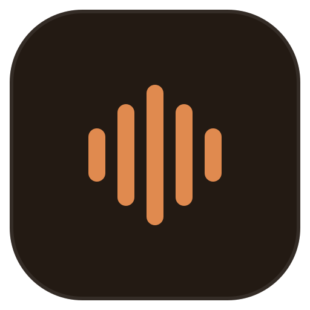

# Lumen ASR

<p align="center">
  
</p>

<p align="center">
  <strong>Speak. Polish. Paste.</strong><br />
  Local-first voice dictation for macOS and Windows — hold a hotkey, talk, get clean text for the app you’re already using.
</p>

<p align="center">
  <a href="#english">English</a> · <a href="#中文">中文</a>
</p>

---

<a id="english"></a>

## English

### Why Lumen

Most “voice typing” stops at raw speech-to-text. Lumen is built for **writing into real work**:

1. **Hold** your dictation hotkey and speak  
2. **Release** — local speech recognition turns audio into text  
3. Optional **AI cleanup** fixes punctuation, fillers, and structure  
4. Text is **pasted into the focused field** (editor, chat, browser, IDE…)  
5. Sessions stay in **History**; you can replay audio, edit, and grow a personal dictionary  

**Local by default.** Recognition can run on your Mac with SenseVoice, Qwen3-ASR, or Whisper. Cleanup can stay on-device (e.g. Ollama). When local recognition or rewrite quality isn’t enough, switch ASR to OpenAI Audio or the corrector to a cloud OpenAI-compatible API.

| You want… | Use |
|-----------|-----|
| Privacy + lightweight offline ASR | Local SenseVoice (default) |
| Higher-accuracy local ASR | Local Qwen3-ASR |
| Another fully local ASR path | Local Whisper |
| Cloud transcription | OpenAI Audio-compatible API |
| Light cleanup, no cloud | Local LLM (Ollama / LM Studio) |
| Stronger rewrite / translation | Cloud corrector (e.g. MiniMax-M3, other OpenAI-compatible APIs) |
| Just the raw transcript | Cleanup level **None** / raw intent |

### Features

- **Push-to-talk** (default) or toggle recording  
- **Intent hotkeys** — e.g. default cleanup vs **translate** to another language  
- **Floating capsule** while you speak (doesn’t steal focus from the typing target)  
- **Cleanup strength** — none / light / medium / strong  
- **Context-aware cleanup** — optionally use bounded text near the cursor; full captured context stays encrypted locally
- **Personal dictionary** — terms & replacements; learn from attributed post-insert edits
- **Terminal pane observation** — follow edits in Herdr, tmux, and Zellij instead of depending only on Accessibility text
- **Auditable pipeline records** — immutable attempts, context provenance, and edit-observation outcomes alongside session history
- **Independent local model selections** — switch SenseVoice, Qwen3-ASR, and Whisper without overwriting each other’s paths or cleanup profile
- **Offline file CLI** — diarize + per-turn ASR on whole recordings (m4a/mp3/wav), with sherpa-onnx **Qwen3-ASR** / Metal **mlx-whisper**, short-turn merge, and optional bilingual LLM translation; see [docs/OFFLINE_FILE_TRANSCRIPT.md](./docs/OFFLINE_FILE_TRANSCRIPT.md)
- **Meeting file import** — choose or drop wav/mp3/m4a/mp4 in the meeting library; same transcript + structured minutes pipeline as a live recording
- **First-run onboarding** — Microphone, then Accessibility on macOS (drag the current app into System Settings instead of hunting with “+”)  

### Offline file transcription (CLI)

Headless mode on the desktop binary (no GUI, no meeting library writes):

```bash
./target/release/lumen-asr-desktop meeting process ./recording.m4a \
  --engine mlx-whisper --lang es \
  --format bilingual --translate zh
```

Engines: `sensevoice` (CJK dictation), `qwen` (sherpa-onnx multi-lingual, auto-detects language), `mlx-whisper` (Metal Whisper turbo), `whisper` (sherpa CPU only). Full flags and model layout: [docs/OFFLINE_FILE_TRANSCRIPT.md](./docs/OFFLINE_FILE_TRANSCRIPT.md).

### Requirements

- macOS 12+ on Apple Silicon, or Windows 10/11 x64
- **Microphone** — to record
- **Accessibility on macOS** — to paste into other apps (without it, Lumen
  copies to the clipboard)
- **Windows insertion** — Unicode typing and Ctrl+V paste into the focused
  window. Copy-only is the fallback when the target refuses input (for
  example an elevated app). Application context capture is not available yet
- Optional: [Ollama](https://ollama.com) or any OpenAI-compatible API key for AI cleanup  

### Install & run (from source)

Prebuilt ad-hoc signed DMGs for Apple Silicon are published on
[GitHub Releases](https://github.com/fakechris/lumen-asr/releases). Tagged
releases also publish a Windows x64 NSIS installer. Intel Mac and Windows x86
installers are not provided. macOS requires a one-time
manual approval under **System Settings → Privacy & Security**. See
[docs/MACOS_GITHUB_RELEASE.md](./docs/MACOS_GITHUB_RELEASE.md) for verification and installation.

The project is applying to SignPath Foundation for trusted direct Windows
downloads. **Free code signing provided by
[SignPath.io](https://signpath.io/), certificate by
[SignPath Foundation](https://signpath.org/).** Until acceptance and workflow
integration, Windows assets are clearly identified as unsigned.

Windows developers can create a free self-signed MSIX for local testing. This
requires explicitly trusting the local development certificate and does not
replace Store or SignPath signing. See
[docs/WINDOWS_LOCAL_SIGNING.md](./docs/WINDOWS_LOCAL_SIGNING.md).

To build locally instead:

```bash
git clone <your-repo-url> lumen-asr
cd lumen-asr

# Build release app, install into .app, codesign, open
./dev-install.sh --open
```

Dev loop (hot reload UI):

```bash
cd apps/desktop
npm install
npm run tauri dev
```

> **Signing tip:** after every release build, reinstall with `./dev-install.sh` so the `.app` signature stays valid. Prefer a trusted local Code Signing certificate or free Apple Development identity so Mic / Accessibility grants survive rebuilds. Details: [docs/MACOS_LOCAL_SIGNING.md](./docs/MACOS_LOCAL_SIGNING.md).

### First-time setup (step by step)

#### 1. Launch Lumen ASR

Open `Lumen ASR.app` (from `./dev-install.sh --open` or your install path).  
If the system says the app is blocked, use **right-click → Open** once (local builds are not App Store notarized).

#### 2. Complete onboarding

The wizard is four steps (about a minute). The dictation model downloads in the background.

| Step | What to do | Why |
|------|------------|-----|
| Welcome | Continue | What Lumen does |
| Permissions | Allow microphone. On macOS, open Accessibility and **drag the floating Lumen icon into the list**, then flip the switch | Recording + paste into other apps |
| Hotkey | Keep the default, or change it | Hold to speak |
| Ready | Optional try-dictation, then start | First success |

You can re-open onboarding later from Settings if permissions were skipped.

#### 3. Grant permissions in System Settings

**System Settings → Privacy & Security**

- **Microphone** → enable **Lumen ASR**  
- **Accessibility** → enable **Lumen ASR**  

Quit Lumen fully and reopen after toggling Accessibility.

#### 4. Choose a speech recognition engine

The default remains **SenseVoice** via sherpa-onnx. Lumen keeps a separate model path for each local engine, so switching engines does not overwrite the previous selection.

| Engine | Best for | What it needs |
|--------|----------|---------------|
| **SenseVoice** | Lower resource use, fast local dictation | `model.int8.onnx` (or `model.onnx`) + `tokens.txt` |
| **Qwen3-ASR** | Higher local accuracy; auto-detects the spoken language | sherpa-onnx model dir (`conv_frontend.onnx`, `encoder.int8.onnx`, `decoder.int8.onnx`, `tokenizer/`) — downloadable in Settings |
| **Whisper** | Alternative local ONNX pipeline | Encoder ONNX + decoder ONNX + tokens text file |
| **OpenAI Audio** | Cloud transcription | Compatible endpoint, model, and API key |

Shared local model root:

1. `LUMEN_MODELS_DIR` (environment override)
2. `~/Library/Application Support/Lumen/models/`

Engine-specific overrides such as `LUMEN_SENSEVOICE_DIR` and `LUMEN_WHISPER_DIR` take priority. Lumen also discovers ready models in older Lumen/Navi and coli locations without moving them.

In the app, open **Settings → Speech recognition** to select an engine, choose a discovered model, or validate a custom directory.

Qwen3-ASR runs in-process via sherpa-onnx (no Python runtime); Settings → Speech recognition offers a one-click download of the pinned model package.

#### 5. Choose AI cleanup (recommended path)

**Principle:** local first; go online when quality matters more than privacy.

| Mode | Settings | When |
|------|----------|------|
| **Local** | Corrector → Ollama, model you pulled (e.g. `qwen3.5:9b`) | Everyday notes, private text |
| **Cloud** | Corrector → MiniMax / OpenAI-compatible, API key + model (prefer **MiniMax-M3** for cleanup; thinking is turned off automatically) | Better rewrite & translation latency/quality |
| **Off** | Cleanup **None**, or corrector disabled | Raw ASR only |

Config file (advanced):  
`~/Library/Application Support/LumenAsr/config.toml`

> **Context privacy:** Lumen can keep a bounded, encrypted local snapshot for audit and provenance. Cursor-near text is included in a corrector request only when **Use current app and nearby text** is enabled. With a cloud corrector, that bounded projection leaves the Mac; the full captured snapshot does not.

#### 6. Learn the hotkeys

| Action | Default (customize in Settings) |
|--------|----------------------------------|
| Dictation (hold) | Your primary chord (e.g. **⌥⇧** / Alt+Shift) |
| Translate intent | Secondary chord if you enabled it (e.g. **⌃⌥**) |

**Flow**

1. Click into any text field (Notes, Slack, browser, IDE…).  
2. **Hold** the dictation hotkey — capsule appears.  
3. Speak.  
4. **Release** — Lumen recognizes, cleans up, pastes.  
5. Open **History** to replay audio or copy text again.  

#### 7. Tune output quality

- **Cleanup level** — Medium is a good default (clear, light cleanup).  
- **Dictionary** — add product names / jargon so ASR + cleanup keep them.  
- **History → edit** — improve a line and save learn candidates when offered.  

### Terminal pane edit learning

After inserting dictated text, Lumen can observe a correction through the terminal tool’s pane API. It pins the outer terminal surface and the inner client/session/pane identity, then attributes only a unique edit to the inserted line. This avoids screen selection tricks and survives unrelated TUI redraws.

| Environment | Read path | Support |
|-------------|-----------|---------|
| **Herdr** | Locked Herdr pane ID + unwrapped recent render buffer | Direct pane observation |
| **tmux** | Locked client/session/pane + `capture-pane -J` | Direct pane observation |
| **Zellij** | Locked client/pane + targeted `dump-screen --pane-id` | Direct on **Zellij 0.44+**; older versions fall back to Accessibility |
| **Ghostty** | Stable outer terminal identity | Hosts the inner Herdr/tmux/Zellij adapter; Ghostty itself is not read as a screen source |

Pane attribution is intentionally limited to a uniquely rendered single line. Multiline or ambiguous renders fall back to Accessibility rather than guessing. If Lumen cannot prove that the same pane is still active, it also fails closed to the Accessibility observer. Raw pane snapshots are not logged or stored; only hashes and the attributed edited span enter the learning/audit records. Enable post-insert observation under **Settings → Edit learning**.

### Day-to-day tips

- Prefer **hold** mode until the gesture feels natural.  
- If paste fails, check Accessibility and whether the target app accepts clipboard paste.  
- If audio playback sounds wrong after many rapid tests, rebuild with `./dev-install.sh` (capture fixes ship in recent builds).  
- Cloud correctors: use models that support **disabling thinking** for dictation speed; Lumen sends no-thinking flags where the API allows it.  

### Project layout (for contributors)

```
apps/desktop/     Tauri + React app
crates/           Rust workspace (ASR, corrector, store, inject, …)
scripts/macos/    Local build, codesign, install
docs/             Design & platform notes
```

More detail: [PRODUCT.md](./PRODUCT.md) · [ARCHITECTURE.md](./ARCHITECTURE.md)

### License

Lumen ASR is licensed under the [GNU General Public License v3.0
only](./LICENSE). Release integrity and signing requirements are documented in
the [Code signing policy](./CODE_SIGNING_POLICY.md). See the
[Privacy policy](./PRIVACY.md) for local storage and optional network
processing.

---

<a id="中文"></a>

## 中文

<p align="right"><a href="#english">English</a> · <a href="#中文">中文</a></p>

### Lumen 是什么

**按住快捷键说话 → 松手 → 干净文本出现在当前输入框。**

Lumen 面向真实写作场景：本地语音识别 + 可选 AI 整理/翻译 + 自动粘贴到当前 App，并保留历史与个人词库。

**默认本地。** 识别可使用本机 SenseVoice、Qwen3-ASR 或 Whisper；整理可使用本机大模型（如 Ollama）。本地识别或改写效果不够时，可以把 ASR 切到 OpenAI Audio，或把修正器切到在线 OpenAI 兼容接口。

| 需求 | 建议 |
|------|------|
| 隐私、轻量离线识别 | 本地 SenseVoice（默认） |
| 更高精度的本地识别 | 本地 Qwen3-ASR |
| 另一条全本地识别路径 | 本地 Whisper |
| 在线语音转写 | OpenAI Audio 兼容接口 |
| 轻度整理、不上云 | 本地 LLM（Ollama / LM Studio） |
| 更强改写 / 翻译 | 在线修正（如 MiniMax-M3 等兼容接口） |
| 只要原始转写 | 整理强度选「无」 |

### 功能一览

- 默认 **按住说话**，也可切换为开关模式  
- **意图快捷键**（如默认整理 vs **翻译**）  
- 说话时 **悬浮胶囊**（不抢当前输入焦点）  
- 整理强度：无 / 轻 / 中 / 强  
- **上下文辅助整理**：可选择发送光标附近的有界文本，完整上下文只在本机加密保存
- **个人词库**：从已归因的插入后修改中生成术语与替换候选
- **终端 pane 观察**：直接跟踪 Herdr、tmux、Zellij 中的修改，不只依赖辅助功能文本
- **可审计流水线记录**：在会话历史之外保存不可变尝试、上下文来源与编辑观察结果
- **整段录音 CLI**：对 m4a/mp3/wav 做说话人分段 + 逐段 ASR（sherpa-onnx **Qwen3-ASR** / Metal **mlx-whisper**）、短段合并、可选双语 LLM 翻译；详见 [docs/OFFLINE_FILE_TRANSCRIPT.md](./docs/OFFLINE_FILE_TRANSCRIPT.md)
- **会议文件导入**：在会议库选择或拖入 wav/mp3/m4a/mp4/opus，走与现场录音相同的转写与纪要流程（会议录音默认存为 Opus，可在设置中切回 WAV）

### 整段录音离线转写（CLI）

桌面二进制的 headless 模式（不启 GUI、不写入会议库）：

```bash
./target/release/lumen-asr-desktop meeting process ./recording.m4a \
  --engine mlx-whisper --lang es \
  --format bilingual --translate zh
```

引擎：`sensevoice`（听写/CJK）、`qwen`（sherpa-onnx 多语，自动识别语种）、`mlx-whisper`（Metal Whisper）、`whisper`（sherpa CPU）。完整参数与模型目录见 [docs/OFFLINE_FILE_TRANSCRIPT.md](./docs/OFFLINE_FILE_TRANSCRIPT.md)。
- **本地模型独立配置**：切换 SenseVoice、Qwen3-ASR、Whisper 时保留各自路径与整理配置
- 首次启动 **引导**：麦克风，然后（macOS）把当前应用拖进系统设置的辅助功能列表  

### 环境要求

- Apple Silicon 上的 macOS 12+，或 Windows 10/11 x64
- **麦克风**：录音
- **macOS 辅助功能**：向其他 App 粘贴（未授权时仅复制到剪贴板）
- **Windows 插入**：用 Unicode 输入和 Ctrl+V 写入当前窗口；目标拒绝输入时复制到剪贴板。暂不采集应用上下文
- 可选：Ollama 或任意 OpenAI 兼容 API，用于 AI 整理  

### 安装与启动（源码）

Apple Silicon 的 ad-hoc 签名 DMG 会发布在
[GitHub Releases](https://github.com/fakechris/lumen-asr/releases)，tag
发布也会包含 Windows x64 NSIS 安装程序；不提供 Intel Mac 或 Windows
x86 安装包。macOS 首次启动需要前往
**系统设置 → 隐私与安全性**手工放行。校验与安装方法见
[docs/MACOS_GITHUB_RELEASE.md](./docs/MACOS_GITHUB_RELEASE.md)。

项目正在申请 SignPath Foundation 的 Windows 可信签名。免费签名服务由
[SignPath.io](https://signpath.io/) 提供，证书由
[SignPath Foundation](https://signpath.org/) 提供。获批并接入流水线前，
Windows 下载会明确标记为未签名。

Windows 开发者可以为本机测试免费创建自签名 MSIX；该流程需要显式信任
本地开发证书，不能替代 Store 或 SignPath 的正式签名。详见
[docs/WINDOWS_LOCAL_SIGNING.md](./docs/WINDOWS_LOCAL_SIGNING.md)。

如需从源码构建：

```bash
git clone <仓库地址> lumen-asr
cd lumen-asr

# 编译 release、装入 .app、签名并打开
./dev-install.sh --open
```

开发热更新：

```bash
cd apps/desktop
npm install
npm run tauri dev
```

> **签名提示：** 每次 release 编译后请用 `./dev-install.sh` 重新安装，否则 `.app` 签名会失效。建议使用受信任的本地代码签名证书或免费 Apple Development 证书，以便麦克风/辅助功能授权在重装后尽量保留。详见 [docs/MACOS_LOCAL_SIGNING.md](./docs/MACOS_LOCAL_SIGNING.md)。

### 第一次使用（分步）

#### 1. 打开应用

启动 **Lumen ASR**。若系统提示无法打开，对该 `.app` **右键 → 打开** 一次（本地构建未经 App Store 公证）。

#### 2. 走完引导

| 步骤 | 操作 | 目的 |
|------|------|------|
| 欢迎 | 继续 | 一句话说明 |
| 权限 | 允许麦克风。macOS 打开辅助功能后，把浮层图标拖进列表并打开开关 | 录音 + 插入其它应用 |
| 热键 | 保持默认，或改成你习惯的组合 | 按住说话 |
| 就绪 | 可选试听，然后开始使用 | 第一次成功 |

跳过引导后可在设置中再次打开。

#### 3. 系统权限

**系统设置 → 隐私与安全性**

- **麦克风** → 勾选 **Lumen ASR**  
- **辅助功能** → 把浮层里的 Lumen 图标拖进列表并打开开关（不必点「+」去找应用）  

修改辅助功能后请完全退出再打开 Lumen。

#### 4. 选择语音识别引擎

默认仍是 sherpa-onnx 驱动的 **SenseVoice**。每个本地引擎都有独立的模型路径，来回切换不会覆盖之前的选择。

| 引擎 | 适用场景 | 所需内容 |
|------|----------|----------|
| **SenseVoice** | 资源占用较低、快速本地听写 | `model.int8.onnx`（或 `model.onnx`）+ `tokens.txt` |
| **Qwen3-ASR** | 更高精度的本地识别；自动识别语种 | sherpa-onnx 模型目录（`conv_frontend.onnx`、`encoder.int8.onnx`、`decoder.int8.onnx`、`tokenizer/`），可在设置页一键下载 |
| **Whisper** | 另一条本地 ONNX 路线 | encoder ONNX + decoder ONNX + tokens 文本 |
| **OpenAI Audio** | 在线转写 | 兼容接口、模型与 API Key |

本地模型共享根目录：

1. 环境变量 `LUMEN_MODELS_DIR`
2. `~/Library/Application Support/Lumen/models/`

`LUMEN_SENSEVOICE_DIR`、`LUMEN_WHISPER_DIR` 等引擎变量优先。Lumen 也会发现旧版 Lumen/Navi 与 coli 目录中的可用模型，但不会自动移动它们。

在应用内打开 **设置 → 语音识别**，可以切换引擎、选择已发现模型，或验证自定义目录。

Qwen3-ASR 通过 sherpa-onnx 在进程内运行（无需 Python runtime）；设置 → 语音识别里可一键下载钉住哈希的模型包。

#### 5. 配置 AI 整理（推荐策略）

**原则：默认本地；效果不够再上云。**

| 方式 | 设置 | 适用 |
|------|------|------|
| **本地** | AI 修正 → Ollama + 已拉取模型 | 日常、隐私优先 |
| **云端** | MiniMax / 其他兼容接口 + API Key（听写建议 **MiniMax-M3**，请求侧会关闭 thinking） | 更强改写与翻译 |
| **关闭** | 整理强度「无」或关闭修正 | 只要 ASR 原文 |

高级配置：`~/Library/Application Support/LumenAsr/config.toml`

> **上下文隐私：** Lumen 可以把有长度上限的上下文加密保存在本机，用于审计与来源记录。只有开启“用当前应用和光标附近文字辅助纠错”后，才会把光标附近的有界投影加入修正请求；使用云端修正器时，这份投影会离开本机，完整快照不会上传。

#### 6. 快捷键与使用流程

| 动作 | 默认（可在设置中改） |
|------|----------------------|
| 听写（按住） | 主快捷键（如 **⌥⇧**） |
| 翻译意图 | 若已启用的副快捷键（如 **⌃⌥**） |

**标准流程**

1. 光标点进任意输入框  
2. **按住**听写键 — 出现胶囊  
3. 说话  
4. **松开** — 识别 → 整理 → 粘贴  
5. 在 **历史** 中回放录音或再次复制  

#### 7. 提高成品质量

- 整理强度默认 **中** 即可  
- 在 **词库** 加入专有名词  
- 在历史中改稿，有学习建议时按需入库  

### 终端 pane 编辑学习

听写文本插入后，Lumen 可以通过终端工具自身的 pane API 观察用户修改。它会锁定外层终端界面和内层 client/session/pane 身份，只在插入行能够唯一归因时记录修改，不需要通过后台选中文字来读取屏幕，也不会被无关的 TUI 重绘误导。

| 环境 | 读取路径 | 支持状态 |
|------|----------|----------|
| **Herdr** | 锁定 Herdr pane ID，读取未软换行的近期渲染缓冲区 | 直接 pane 观察 |
| **tmux** | 锁定 client/session/pane，使用 `capture-pane -J` | 直接 pane 观察 |
| **Zellij** | 锁定 client/pane，定向调用 `dump-screen --pane-id` | **Zellij 0.44+** 直接观察；旧版本回退辅助功能 |
| **Ghostty** | 锁定稳定的外层 terminal 身份 | 读取内层 Herdr/tmux/Zellij；不把 Ghostty 自身当作 screen 数据源 |

pane 归因目前只处理能够唯一定位的单行文本。遇到多行或画面歧义时会回退辅助功能，不会猜测。如果无法证明当前仍是同一个 pane，同样会安全回退。pane 原始快照不会写入日志或数据库，只保存哈希与归因后的修改片段。可在 **设置 → 编辑学习 → 粘贴后监听目标输入框改动** 中启用。

### 日常提示

- 先用 **按住** 模式建立肌肉记忆  
- 粘贴失败时检查辅助功能与目标 App 是否接受粘贴  
- 云端模型：听写场景尽量选 **可关闭 thinking** 的型号，延迟更低  
- 重新编译后请执行 `./dev-install.sh`，不要只拷贝二进制进 `.app`  

### 仓库结构（给开发者）

```
apps/desktop/     桌面端（Tauri + React）
crates/           Rust 工作区
scripts/macos/    本地编译与签名
docs/             设计与平台说明
```

更多：[PRODUCT.md](./PRODUCT.md) · [ARCHITECTURE.md](./ARCHITECTURE.md)

### 许可证

Lumen ASR 使用 [GNU General Public License v3.0
only](./LICENSE) 授权。发布完整性与签名要求见
[代码签名政策](./CODE_SIGNING_POLICY.md)，本地存储与可选网络处理见
[隐私政策](./PRIVACY.md)。
